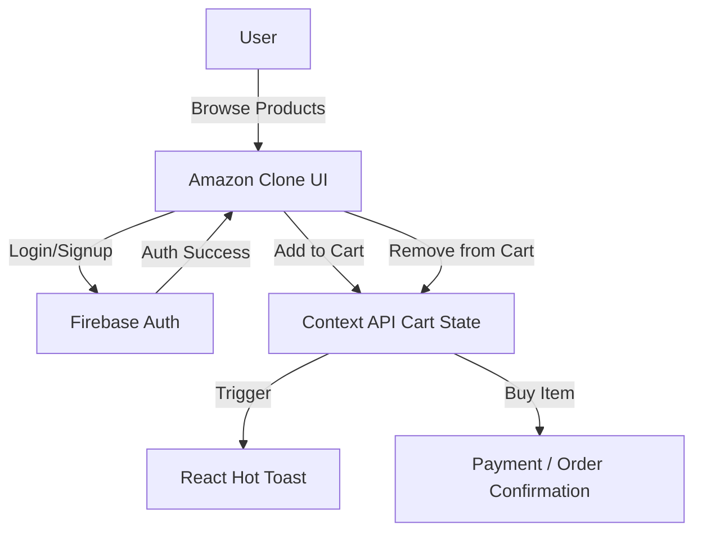

# 🛒 Amazon Clone  

A **responsive Amazon Clone** built with **React-Vite**, styled using **CSS**, featuring **Firebase Authentication**, **Shopping Cart**, and real-time **toast notifications** with **React Hot Toast**.  

🔗 **Live Demo**: [Amazon Clone](https://amazon-clone-xi-two.vercel.app/)  

---
## 📸 Screenshots
-----------------------


----------


---------------


---------------------------


## 🚀 Features  

- 📱 **Responsive design** (mobile, tablet, desktop)  
- 🔐 **Firebase Authentication** (login & signup)  
- 🛍️ **Cart system** powered by Context API  
- ⚡ **Add to Cart / Remove from Cart** functionality  
- 🔔 **Toast notifications** (React Hot Toast) when:  
  - Adding items to cart  
  - Deleting items from cart
  - Updating item quantity  

- 🖼️ Clean UI inspired by Amazon  

---

## 🛠️ Tech Stack  

- **Frontend**: React  
- **Styling**: CSS  
- **Auth**: Firebase Authentication  
- **State Management**: Context API  
- **Notifications**: React Hot Toast  

---

## 📊 Project Flow  


-------------------------------

# 📂 Project Structure
```
└── 📁AmazonClone
    └── 📁public
    └── 📁src
        └── 📁assets
            └── 📁images
                └── 📁icons
                    ├── searchIcon.png
                    ├── shopping-cart.png
                    ├── star.png
                └── 📁products
                    ├── 1.png
                    ├── 2.png
                    ├── 3.png
                    ├── 4.png
                    ├── 5.png
                    ├── 6.png
                ├── back to school.jpg
                ├── checkoutAd.jpg
                ├── header-logo.png
                ├── login-logo.png
                ├── NotFound.jpg
        └── 📁components
            └── 📁CheckoutProduct
                ├── CheckoutProduct.css
                ├── CheckoutProduct.jsx
            └── 📁Header
                ├── Header.css
                ├── Header.jsx
            └── 📁Products
                ├── Product.css
                ├── Product.jsx
            └── 📁SubTotalItems
                ├── SubTotalItems.css
                ├── SubTotalItems.jsx
        └── 📁context
            ├── AppReducer.js
            ├── GlobalState.jsx
            ├── initialState.js
        └── 📁firebase
            ├── firebase.js
        └── 📁pages
            └── 📁Checkout
                ├── Checkout.css
                ├── Checkout.jsx
            └── 📁Home
                ├── Home.css
                ├── Home.jsx
            └── 📁Login
                ├── Login.css
                ├── Login.jsx
            └── 📁NotFound
                ├── NotFound.css
                ├── NotFound.jsx
            └── 📁Payment
                ├── Payment.css
                ├── Payment.jsx
        ├── App.css
        ├── App.jsx
        ├── index.css
        ├── main.jsx
    ├── .env
    ├── .gitignore
    ├── eslint.config.js
    ├── index.html
    ├── package-lock.json
    ├── package.json
    ├── README.md
    └── vite.config.js
```
---

----------------------------
# ⚙️ Installation & Setup

### Clone the repository
git clone https://github.com/your-username/amazon-clone.git

### Navigate into project
cd amazon-clone

### Install dependencies
npm install

### Add Firebase config
### .env
VITE_FIREBASE_API_KEY=your_api_key
VITE_FIREBASE_AUTH_DOMAIN=your_project.firebaseapp.com
...

### Start development server
npm run dev

-----------------------------------------


# Built with ❤️ by Ali Mahmoud.

Black wolf
